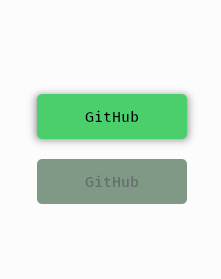

# bevy_extended_ui
___
[](./LICENSE)
[](https://github.com/exepta/bevy_extended_ui/actions/workflows/build.yml)


Since I've been writing a game in the [_Bevy_](https://bevyengine.org/) engine lately, 
I created this crate. In my game, 
I need more complex UI elements that aren't currently supported by Bevy. 
These include sliders, choice boxes, check boxes, radio buttons, and so on. 
So I set about implementing these elements using the standard bevy_ui system. 
I'd like to make this project available to you so that you can use elements other 
than just nodes, buttons, or images. If you're missing a widget and know how 
to create it, it would be great if you could add it. 
Otherwise, feel free to create a ticket.

> *Note:* This project is currently under construction and not suitable for large projects!.

## Example
___

Here I will show you how to use the bevy_extended_ui:


First we need to integrate the plugin into your project.
```rust
fn main() {
  let _ = App::new()
          .add_plugins((DefaultPlugins, ExtendedUiPlugin))
          .run();
}
```


Next, you can get started right away. Currently, there are widgets (Div, Button, Checkbox, InputField, and Slider). Note that these aren't all the widgets! More are coming soon.

Here's a simple example of a button that we spawn
```rust
    commands.spawn((
        Div::default(),
        CssSource(String::from("test.css")),
        CssClass(vec![".div-test".to_string(), ".div-override".to_string()]),
        children![
            Button::default(),
            Button::default()
        ]
    ));
```
In the end it should look like this:



All Widgets support CSS3 and can apply many of the default css rules. Note that the current system working with css but
not perfect yet! Let me explain it:

```css
button {
    background: rgb(255, 255, 255); /* will be white */
    display: flex; /* set node display flex */
}

button:hover {
    background: rgba(200, 200, 200, 200); /* will work correctly */
}

.button-text {
    color: #FFFFFF; /* is white and working */
}

/* THIS WORK IF THE BUTTON IS HOVERED! */
.button-text:hover {
    color: red; /* set red */
}

/* THIS WILL NOT WORK! */
button:hover .button-text {
    color: red; /* set red */
}
```

| `Bevy` version | `bevy_extended_ui` version |
|----------------|----------------------------|
| 0.16.0         | 0.1.0                      |